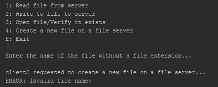

# CS4400 - Distributed File Server #

### Breandan Kerin - B.A.I Computer Engineering, Trinity College Dublin - 14310166 ###

This project was completed as part of my module, CS4400 - Internet Applications in Trinity College Dublin (_TCD_).
The source code can be viewed [Here](https://bitbucket.org/Breandan96/cs4400distributedfileserver)

The aim of this project is to implement a Distributed File Server, modelled as either an NFS; _Network File System_ which is the system
I am modelling in this project, or AFS; _Andrew File System_style server. The system also has to have some other features
implemented, a minimum of four had to be chosen from the following list:

*    *_Distributed Transparent File Access - Either AFS or NFS_*
*    Security Service
*    _Directory Service_
*    Replication
*    _Caching_
*    Transactions
*    _Lock Service_

The features implemented in this project are highlighted above as the italicised values, and the emboldened value is compulsory
for the project.

### Launching the System ###
This application can be run either on Windows or Linux; It has not yet been tested on Mac OS Operating systems. All servers are run on localhost (127.0.0.1). In this project,
several shell scripts are provided to launch the system. These scripts can be used to run the system through a Command Line Interface; _CLI_,such as terminal
on Linux. To run these scripts, the permissions need to be granted in order for them to be executed. The permissions can be granted as follows:
_chmod 755 <script name>_. The list below is the list of required commands to give permissions in this project:

*    chmod 755 install_requirements.sh
*    chmod 755 launch_directory_server.sh
*    chmod 755 launch_file_server.sh
*    chmod 755 launch_locking_server.sh
*    chmod 755 launch_client.sh

To launch the system, first give the permissions as shown above, then in order to run the scripts, a command similar
to the following is used: *./<script name>.sh*
The list below shows the order in which to run each of the scripts.

*    ./install_requirements.sh
    * This script must be run first. It will install all of the required dependencies in order for the service to run, it installs
    all of the listed requirements from the *requirements.txt* file.
*    ./launch_directory_server.sh
    * This script will run the directory server launching script. It will make the directory server available at the URL "http://127.0.0.1:46666"
    * This address and port number is known by every entity that requires it; file server, lock server and client.
*    ./launch_locking_server.sh
    * This script runs the locking server. In relation to the order of launch, this and the file server scripts can be run interchangeably.
    * This script runs the locking server at URL "http://127.0.0.1:46667".
*    ./launch_file_server.sh <number_of_servers_to_spawn>
    * This script runs up a series of file servers. For this file, the number of file servers to spawn must be specified in the
    <number_of_servers_to_spawn> field. Here, the first file server will be hosted on port "46668",  and every subsequent file server spawned
    will be hosted on the incremented value of the previous; ie 46668, 46669 etc etc.
    hence the URL for the servers will similar to "http://127.0.0.1:46668"
*    ./launch_client.sh
    * This script will spawn up a single client. To spawn multiple clients, this script will need to be run multiple times. This is
    because each client will be required to input values for file names etc while in use, and would simply cause confusion if they were
    all run on the same window.

### Additional Notes on this project ###
* Originally, I had implemented this project using Sockets; instead of Flask and restful-flask, for my means of communications between
  each of my services (e.g. between a client and a file server). It was only when I had implemented the file server and
  client and had nearly finished work on the directory server, did I realise the error of my ways; I my code ran into an infintite loop when
  repsonding to the cleitns request, and I began implementing this with flask and flask-restful. Changing to REST was a great idea,
  as it simplified my approach significantly and I no longer needed to worry about implementing sockets and handling them and threads between multiple services.
* The last commit that includes code from the socket and multi-threading approach can be found [Here](https://bitbucket.org/Breandan96/cs4400distributedfileserver/commits/805aa84afbe567bdebfe1bca356f20b246f3eae5)

### Languages, Dependencies etc ###
The list of dependencies are highlighted below. This project uses the Python 2.7 project interpreter.
The list of requirements are contained within _requirements.txt_ file. all of the dependencies in this
 list are then downloaded and installed using the _pip install --user -r requirements.txt_ command in the
 *install_requirements.sh* script, which should be run before attempting to launch any of the distributed service scripts.
 The list below indicates all of the dependencies to be installed.
 
*    Flask
*    flask-restful 
*    requests

In order to work effectively with this project, a basic understanding of JSON would be beneficial since the data being stored and
transferred between the classes are in JSON format (it is the default data transfer method in the Flask framework).

## Component 1: Distributed Transparent File Access ##
This system was modelled after the _NFS_ model. The system can support multiple clients and multiple file servers. For this, a
client application was developed which made use of a client API. This client API is essentially a client proxy, which contains the 'brains' of the clients abstracted from the client application itself.
A file server implementation was also developed as a RESTful server that could be written to and read from by a client. The finished project supports the use and management of multiple file-servers and clients.

### 1: Client and Client Library ###
The user application is named _client.py_, and not _clientApi.py_. It acts as an interface to the clientApi.py library, which was mentioned above.
Here, the client is able to make decisions for files stored locally and on the file servers.
Using the ClientApi, the client is able to:

*	Read a remote copy of a file from a file server
*   Write to the remote copy of a file on a file server,
*	Create a file that is stored locally and is also pushed to the server containing the data "First Time file is
 opened.... Edit me!".
 
NOTE:

1.  In order to _open_ a file, the client must first create it locally, using option *4 - Create new file*
    This will create a new file locally in the cache and will also post it to the file server with the contents "First Time file is
    opened.... Edit me!".
2.  In order to write a file to the file server, the file must first exist, hence the client must use option 4 to create the file first
3.  When editing a file, if the client is run on a windows application, the text editor used is Notepad, and if run on a linux system,
    the client has a choice between using Gedit or Nano.

The client.py script is what provides a basic UI for the client. It simply provides the client with a series of options; 1-4 and E, to
either read, write, create file, verify if a file exists; locally or on a file server, and then exit the program.

### 2: File Server ###
The file server class is implemented such that it store the files as a flat-file system, where the files are stored in the file server without any deeper directories used. 

The file server directories are named using the file servers *file_server_id*; which is created when the file server first registers itself with the directory server, appended to 'Server';
ie, 'Server0/', 'Server1/' etc. The file servers directory is created when the file server starts up, just after the file server has registered
with the directory server; hence the *server_id* can be used to ID the file server.

All files stored on a file server follow a simple numerical naming system such as 0.txt. Each file server has a get and post method
with which the clients can communicate to the server with. The *file_id* is determined by the length of the list of files that are
present on a given file server; for example, if a client were to add a new file to a file server that was hosting 10 files, the new files ID would
bw 11.

The server accepts get() and post() requests from all clients that are connected and know the file servers IP and port
number. It can be reached at any available host address and port specified by the user, which are passed as sys.argv[0] and sys.argv[1].
For the client to communicate with the file server, it must first communicate with the directory server, which will be discussed below.

*    A client that wishes to read a remote copy of a file from a file server will need to send a get() request. The client must provide
JSON parameters {'file_id': file_id, 'file_server_id': file_server_id}
*    A client wishing to write to a remote copy of a file will send a post() request. The client must provide JSON parameters {'file_id': file_id, 'data': data, 'server_id': file_server_id, 'file_name': file_name}

NOTE: 

*    There is no *versioning* in that any files written to on the file server are overwritten. The file servers hold no information with regards to the versions of the file. All of this information is stored on the directory server.
*    The versioning implemented is the time/date stamp at which the file was last edited.
*    The file servers are hosted on ports 46668, 46669 etc etc, which are passed in as environment variables at run time.

## Component 2: Directory Service ##

### Directory Server ###
The directory server must be started of first; just after the *install_requirements.sh* script.
This is started up first as the file server and locking server need to register themselves with it and this process has been discussed above in detail. the Directory server is hosted on the URL "http://127.0.0.1:46666".

*    The URL for the Directory Server is known by all parts of the service, and is hardcoded as a global variable.
*    The Directory Server acts as a management server for the entire distributed file system.
*    The Directory server maintains a record of the mappings of the client names as well as the file mappings; ie a list of all connected clients and a list of files that are stored on each of the file servers. On the fileservers, the files are stored like; Server1/0.txt etc.

The Directory server takes in a request by a client, and checks whether the file the client has requested exists on a file server.
*    If the file exists, the directory server returns the IP address and port number of the file server to the client as well as the version of the file, and the client can make communications with the file server using these details.
*    If the version of the file stored on the client is not up-to-date/out-of-sync with the file server this is because another client has since written to the file.

The same works for a write operation also, but if the file doesn't exist on a file server, a round-robin style approach is used to assign the file to the file server with the least load at that time. The load on each of the connected fileservers is something that the directory server maintains a record of alongside the mappings and versions for the files.
*    The file server to store the file is chosen by the directory server because it has the least number files stored on it; i.e the directory server will find the file server that contains the fewest number of files and then uses this file server to store the new file
*    To make this system a little more fair in terms of how much data is stored by the file servers, a possible enhancement would be to assign the new files to the servers that contain the largest _amount of data_, and not just the largest number of files.

The directory server also performs the following functions:

*    It acts a registration system as mentioned above for the file server and lock server
*    It performs a load-balancing on the file servers by means of Round-Robin based on the number of files that are currently stored on the server, as previously described. The directory server will forward the file onto the least loaded file server to be stored.

## Component 3: Caching ##
### Caching for the client ###
Each client has its own cache implemented as a caching *object*. The cache is implemented using Least Recently Used "*LRU*" eviction policy, where each file is stored with a time-date stamp, and the file that was accessed least recently is evicted. In practical terms, this means that the file that was accessed
the furthest back in time will be the first one evicted if (i) a new file is read in from the file server, or (ii) if a new file is created by the client.

Every time a file is read, it will only be read in from the file server if (i) it currently isn't present in the cache, or (ii) if the version in the cache is out-of-date compared to the file server, or (iii) it was created locally. Whatever the case, when it is added to the cache it is added with a time date stamp corresponding to the time that it was last updated in the cache, which is formatted
as follows: *2012-12-15 01:21:05*.

The cache can store up to a maximum of 3 files simply for the purpose of illustration. Depending on the requirements of the application, it might make more sense to increase the number of entries allowed in the cache at any one time. To increase the number of files that the cache can store, the value of global variable MAX_SIZE_OF_CACHE could easily be altered (which can be found at the top of the cache class).

This cache is implemented as a * Direct Mapped Cache*; each tag has its own slot in cache memory. The operations that can be performed by the cache, that are of direct relevance to the client, are:

1. Reading from cache
    * This allows the user to read files from the cache if the version stored is the same as the version that is stored on the directory server.
2. Adding a new cache entry
    * This method will add a new entry to the cache table if the file isnt in the table at present. This method implements linear probing when adding files to the cache,
    once the cache is full, this function will then begin using the LRU eviction policy. 
3. Updating a cache entry
    * This method will update the data that is stored in a file if the version on the cache is out of sync with the file server.

## Component 4: Locking ##
### Locking Server ###
In this project, I have implemented it so that there is only 1 locking server in the distributed filesystem. The implementation for this server is located in the *LockingServer/LockingServer.py* file.

The locking server manages the operation of both locking and unlocking files for the client whenever a request is sent to the locking server.

The locking server is architectured such that, when a client wishes to write to a file, it sends a request to the directory server, where it is then forwarded onto the locking server, where it can either be locked or refused. The locking server is hosted at **http://127.0.0.1:46667**.

*    It should be noted that for a client to _read_ from a file, it does not need to obtain a lock on the file - if the file is unlocked, then multiple clients can read from the file concurrently.
*    If however the client wishes to _write_ to a file, it must obtain a lock. When there is a lock on a file, no other client bar the client with the lock can operate on that file.

The locking server holds a list of files that currently have a lock on a file. This list works as a lookup table, and has files added and removed from it whenever the lock and unlock requests come in from the client.

I have also implemented a timer on the lock.

*    If the lock has been on a file for longer than **1 minute/60 seconds**, the file is then unlocked. My assumption here is that, when I place a lock on a file (which only happens when a client is writing to a file), that it shouldn't take longer than 1 minute to write my data into the file.
*    Basically if the time taken to write to the file is greater than 1 minute, I have assumed that the client is dead, and the file is then unlocked so that other clients can access it.

This method is the *morgan_turn_on_the_clock* method (https://www.youtube.com/watch?v=l0JaxtwVteY skip to 0:35 to understand..!)

## Screen shots ##
###Creating a file locally - invalid ###

